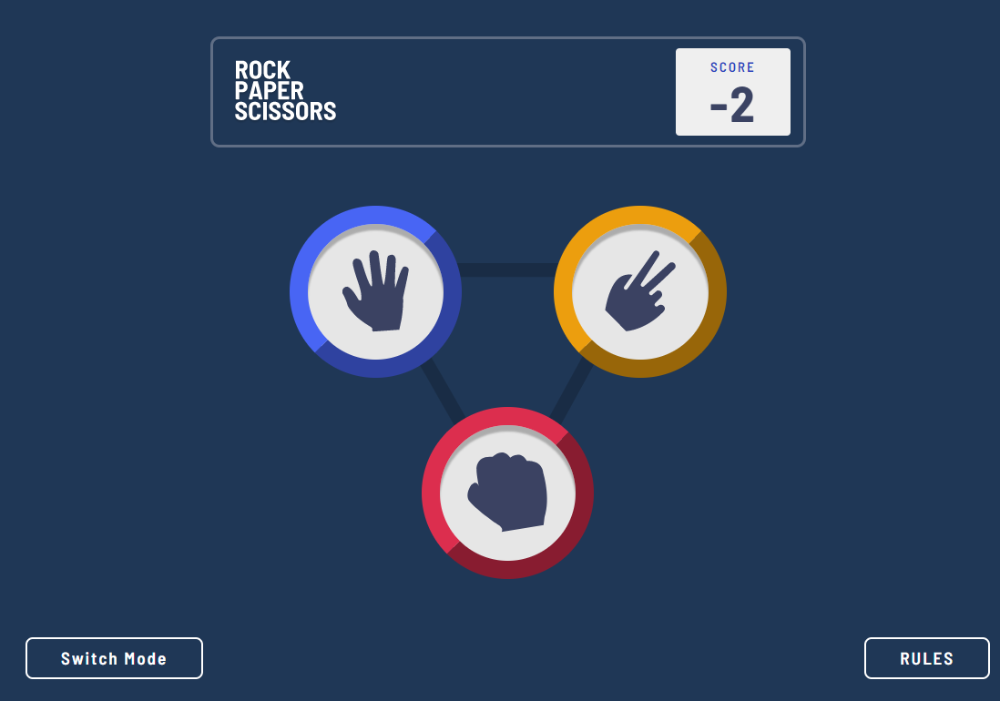
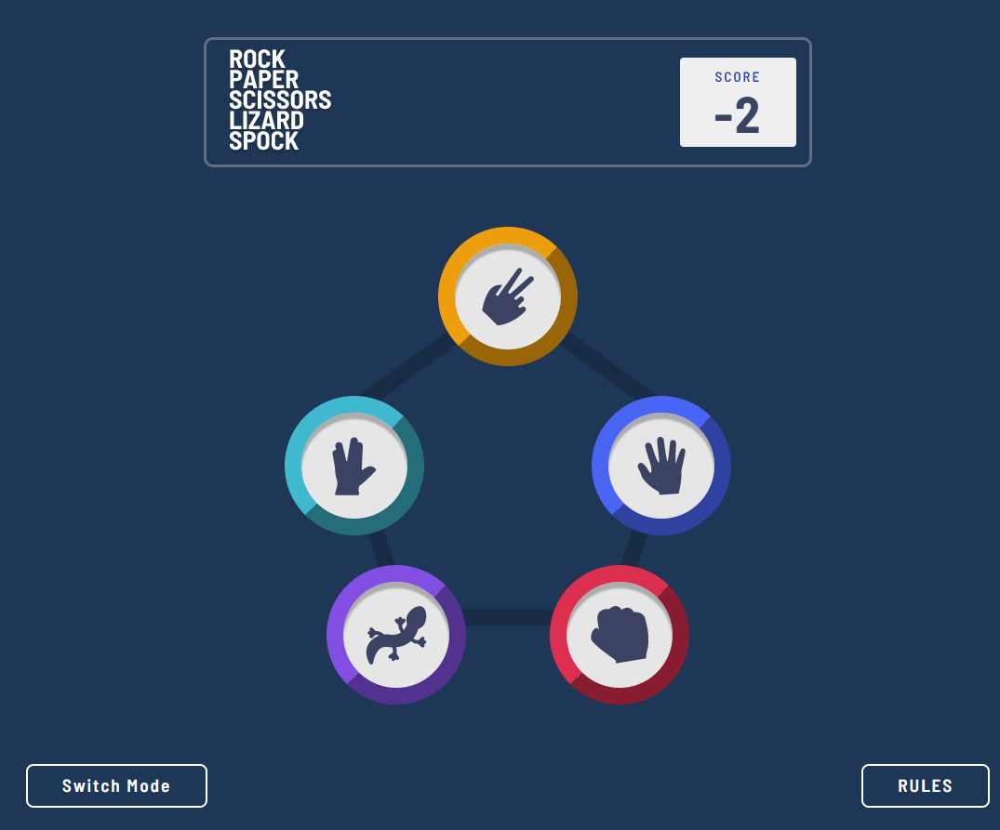

# Frontend Mentor - Rock, Paper, Scissors solution

This is a solution to the [Rock, Paper, Scissors challenge on Frontend Mentor](https://www.frontendmentor.io/challenges/rock-paper-scissors-game-pTgwgvgH). Frontend Mentor challenges help you improve your coding skills by building realistic projects.

## Table of contents

- [Overview](#overview)
  - [Screenshot](#screenshot)
  - [Links](#links)
- [My process](#my-process)
  - [Built with](#built-with)
  - [What I learned](#what-i-learned)
  - [Continued development](#continued-development)
  - [Useful resources](#useful-resources)
- [Author](#author)
- [Acknowledgments](#acknowledgments)

## Overview

This project is built with React and is the first quite complex one I've buit since learning the library. The React App is used as the project's structure and set up.

### Screenshot

### Links

- Solution URL: [GitHub Repo](https://github.com/loulou1994/Rock-Paper-Scissors)
- Live Site URL: [Git Pages](https://loulou1994.github.com/Rock-Paper-Scissors)

## My process

- Built Up the markup first into separate React components
- Styled the page using the sass css preprocessor
- Wrote the js logic and getting help sometimes to some similar achieved works on the github repos
- Debugging the code through the console log and React's dev tool chrome extension

### Built with

- Semantic HTML5 markup
- CSS custom properties
- Flexbox
- CSS Grid
- Mobile-first workflow
- [React](https://reactjs.org/) - JS library

### What I learned

This project was a huge boost for me in my journey to learn React. I got introduced to the useContext hook and further got better at useEffect's convenient use cases.

### Continued development

I plan on continuing to learn React's advanced concepts, namely: Routing, useReducer, and custom hooks...so on

### Useful resources

- [My best friend](https://www.google.com) - Not just in tech worl.
- [StackOverflow](https://www.stackOverflow.com) - I once was stuck in a logic side part where js strictcMode behaviour was weird and threw an error. I found the reason why by reading through a couple of stackOverflow topics' issues.

## Author

- Frontend Mentor - [@loulou1994](https://www.frontendmentor.io/profile/loulou1994)
- Facebook - [@Said Douidi](https://www.facebook.com/profile.php?id=100081072665879)

## Acknowledgments

I'm particularly thankful to one github repo which helped me come up with a slight logic piece solution.
